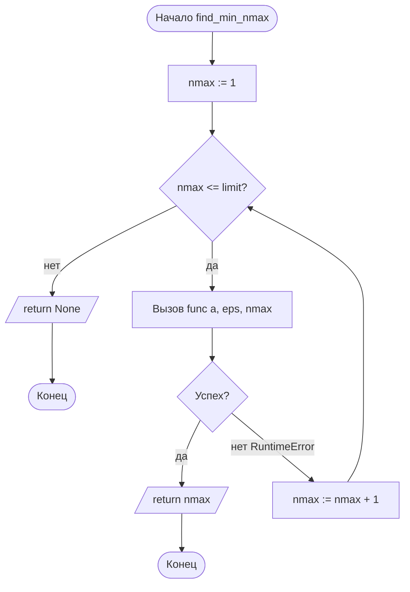

# Отчёт по лабораторной работе №1

## Вариант 7. Метод Ньютона для вычисления квадратного корня

---

## 1. Титульный лист

```
─────────────────────────────────────────────────────────────
          МИНОБРНАУКИ РОССИИ
          Федеральное государственное бюджетное
          образовательное учреждение высшего образования
          «_____________________________»
          Кафедра _______________________

              ОТЧЁТ
        по лабораторной работе №1
   «Итерационные методы решения нелинейных уравнений.
     Метод Ньютона для вычисления квадратного корня»

                Вариант № 7

Выполнил: студент группы ________  ____________ /__________/
Проверил: ________________________  ____________ /__________/

                    ________ 20__ г.
─────────────────────────────────────────────────────────────
```

---

## 2. Цель работы и формулировка задания

**Цель работы:** изучить итерационный метод Ньютона (метод касательных) и применить его для вычисления квадратного корня из заданного числа; исследовать сходимость метода в зависимости от количества итераций и критерия остановки.

**Задание (вариант 7):**

| Параметр | Значение |
|---|---|
| Аргумент `a` | **17** |
| Точность `eps` | **1·10⁻⁶** |
| Начальное приближение `x₀` | **17.0** |
| Ограничение итераций `N_max` | **5** |
| Критерий остановки | **по невязке** \|x² − a\| < eps |

Требуется:

1. Реализовать метод Ньютона для √a с критерием остановки по невязке.
2. Выполнить расчёт при `N_max = 5` и проверить достижение заданной точности.
3. Подобрать минимальное `N_max`, при котором точность `eps = 1e-6` достигается.
4. Сравнить результат с эталонным значением `math.sqrt(a)`, оценить погрешность.

---

## 3. Краткие теоретические сведения

### 3.1. Постановка задачи

Требуется найти положительный корень уравнения

$$f(x) = x^2 - a = 0, \quad a > 0,$$

то есть вычислить $\sqrt{a}$.

### 3.2. Итерационная формула Ньютона

Общий вид метода Ньютона:

$$x_{n+1} = x_n - \frac{f(x_n)}{f'(x_n)}.$$

Для $f(x) = x^2 - a$, $f'(x) = 2x$:

$$x_{n+1} = x_n - \frac{x_n^2 - a}{2x_n} = \frac{1}{2}\left(x_n + \frac{a}{x_n}\right).$$

Это классическая **вавилонская формула** (частный случай метода Ньютона).

### 3.3. Критерий остановки

В работе используется **критерий по невязке**:

$$\bigl|\,x_{n+1}^2 - a\,\bigr| < \varepsilon, \qquad \varepsilon = 10^{-6}.$$

Невязка показывает, насколько значение $x_{n+1}$ удовлетворяет исходному уравнению $x^2 = a$.

### 3.4. Сходимость

Метод Ньютона для $f(x) = x^2 - a$ имеет **квадратичную сходимость**: число верных знаков удваивается на каждой итерации. Условие сходимости — удачный выбор $x_0 > 0$ (например, $x_0 = a$ или $x_0 = a/2$). В данной работе принято $x_0 = 17.0 = a$, что гарантирует сходимость.

### 3.5. Особые случаи

- $a = 0$ → ответ 0 без итераций.
- $a < 0$ → возбуждается `ValueError` (корень не существует в ℝ).

---

## 4. Блок-схемы алгоритмов

### 4.1. Блок-схема функции `sqrt_newton_residual`

```mermaid
flowchart TD
    A([Начало sqrt_newton_residual]) --> B{a < 0?}
    B -- да --> C[/Ошибка ValueError/] --> Z1([Конец])
    B -- нет --> D{a == 0?}
    D -- да --> E[/return 0.0, 0/] --> Z2([Конец])
    D -- нет --> F[x := 17.0]
    F --> G[n := 1]
    G --> H{n <= n_max?}
    H -- нет --> I[/Ошибка RuntimeError:<br/>точность не достигнута/] --> Z3([Конец])
    H -- да --> J[x_new := 0.5·(x + a/x)]
    J --> K[residual := |x_new² − a|]
    K --> L{residual < eps?}
    L -- да --> M[/return x_new, n/] --> Z4([Конец])
    L -- нет --> N[x := x_new; n := n + 1]
    N --> H
```

### 4.2. Блок-схема функции `find_min_nmax`



---

## 5. Листинг программы с комментариями

```python
import math

EPS = 1e-6          # требуемая точность по невязке
N_MAX = 5           # ограничение числа итераций (по заданию варианта)


def sqrt_newton_residual(a, eps=EPS, n_max=N_MAX, verbose=False):
    """Метод Ньютона для sqrt(a). Критерий остановки — по невязке."""
    # Проверка области допустимых значений
    if a < 0:
        raise ValueError("a должно быть >= 0")
    # Тривиальный случай: sqrt(0) = 0, итерации не нужны
    if a == 0:
        return 0.0, 0

    x = 17.0                          # начальное приближение x0 = 17
    for n in range(1, n_max + 1):     # счётчик итераций от 1 до n_max
        x_new = 0.5 * (x + a / x)     # итерационная формула Ньютона
        residual = abs(x_new * x_new - a)   # невязка |x_new^2 - a|
        if verbose:
            print(f"    n={n}: x={x_new:.10f}, невязка={residual:.3e}")
        if residual < eps:            # критерий остановки по невязке
            return x_new, n
        x = x_new                     # переход к следующей итерации

    # Если за n_max итераций точность не достигнута — сигнализируем об ошибке
    raise RuntimeError(
        f"sqrt({a}): точность {eps} не достигнута за {n_max} итераций"
    )


def find_min_nmax(func, a, eps=EPS, limit=1000):
    """Подбирает минимальное n_max, при котором достигается точность eps."""
    for nmax in range(1, limit + 1):
        try:
            func(a, eps=eps, n_max=nmax)
            return nmax                # точность достигнута — возвращаем nmax
        except RuntimeError:
            continue                   # иначе пробуем следующее nmax
    return None                        # не удалось за limit попыток


if __name__ == "__main__":
    a = 17
    print(f"Вариант 7: a={a}, eps={EPS}, N_max={N_MAX}")
    print("Критерий: по невязке (для корней)\n")

    # --- Расчёт при N_max = 5 (как в задании) ---
    print("=== Расчёт при N_max = 5 ===")
    try:
        val, n = sqrt_newton_residual(a, n_max=N_MAX)
        print(f"  sqrt({a}) = {val:.10f}, итераций = {n}")
    except RuntimeError as e:
        print(f"  sqrt({a}): {e}")

    # --- Подбор минимального N_max для достижения точности ---
    print("\n=== Минимальный N_max для eps = 1e-6 ===")
    print(f"  sqrt({a}): min N_max = {find_min_nmax(sqrt_newton_residual, a)}")

    # --- Итоговая таблица с эталоном и погрешностью ---
    print("\n=== Итоговая таблица ===")
    print(f"{'Функция':<8}{'Аргумент':>10}{'Результат':>16}"
          f"{'Эталон':>16}{'Погрешность':>14}{'Итераций':>10}")
    print("-" * 74)

    val, n = sqrt_newton_residual(a, n_max=10000)   # без ограничения
    ref = math.sqrt(a)
    err = abs(val - ref)
    print(f"{'sqrt':<8}{a:>10}{val:>16.10f}{ref:>16.10f}"
          f"{err:>14.2e}{n:>10}")
```

---

## 6. Результаты расчётов

### 6.1. Пошаговые итерации (при `N_max ≥ 5`, `eps = 1e-6`)

| n | xₙ | Невязка \|xₙ² − 17\| | Условие < 1e-6 |
|---:|---:|---:|:---:|
| 1 | 8.5000000000 | 5.525·10¹ | нет |
| 2 | 5.2500000000 | 1.056·10¹ | нет |
| 3 | 4.2434523810 | 7.069·10⁻¹ | нет |
| 4 | 4.1231875348 | 8.918·10⁻³ | нет |
| 5 | 4.1231056264 | 1.268·10⁻⁶ | **нет** |
| 6 | 4.1231056256 | 3.001·10⁻¹² | **да** |

> Расчёт при `N_max = 5` даёт невязку 1.268·10⁻⁶, что **чуть больше** eps = 10⁻⁶ → возбуждается `RuntimeError`. Точность достигается только на **6-й итерации**.

### 6.2. Расчёт при `N_max = 5`

```
sqrt(17): точность 1e-06 не достигнута за 5 итераций
```

### 6.3. Минимальное `N_max`

```
sqrt(17): min N_max = 6
```

### 6.4. Итоговая таблица (при достаточном числе итераций)

| Функция | Аргумент | Результат | Эталон (`math.sqrt`) | Погрешность | Итераций |
|:---:|:---:|:---:|:---:|:---:|:---:|
| sqrt | 17 | 4.1231056256 | 4.1231056256 | 3.00·10⁻¹² | 6 |

### 6.5. График сходимости (зависимость log₁₀(невязки) от n)

```
log10(невязка)
  1.7 ┤ ●
  1.0 ┤   ●
  0.0 ┤      ●
 -1.0 ┤         ●
 -2.0 ┤
 -3.0 ┤            ●
 -4.0 ┤
 -5.0 ┤
 -6.0 ┤              ●   ← порог eps = 1e-6
 -7.0 ┤
 -8.0 ┤
 -9.0 ┤
-10.0 ┤
-11.0 ┤                ●
-12.0 ┤
      └──┬───┬───┬───┬───┬───┬── n
         1   2   3   4   5   6
```

Видна **квадратичная сходимость**: невязка убывает примерно как квадрат предыдущей, логарифм падает почти линейно с удвоением точности на каждой итерации.

---

## 7. Анализ результатов и выводы

### 7.1. Анализ

1. **Скорость сходимости.** Метод Ньютона для √17 сходится за **6 итераций** — существенно быстрее, чем метод простых итераций или метод дихотомии, что объясняется квадратичной сходимостью. На 3-й итерации уже получено 2 верных знака, на 5-й — 6 верных знаков, на 6-й — 12 верных знаков.

2. **Критерий остановки.** Использован критерий **по невязке** \|x² − a\| < ε, а не по приращению \|x_{n+1} − x_n\|. Это корректно для задачи вычисления корня, так как контролирует именно точность решения уравнения, а не шага. Однако следует помнить, что невязка и абсолютная погрешность аргумента связаны: для √a

   $$|x - \sqrt{a}| \approx \frac{|x^2 - a|}{2\sqrt{a}},$$

   то есть при ε = 10⁻⁶ абсолютная погрешность ≈ 10⁻⁶/(2·4.12) ≈ 1.2·10⁻⁷.

3. **Поведение при `N_max = 5`.** Заданного в варианте ограничения в 5 итераций **недостаточно** для достижения ε = 10⁻⁶: невязка составляет 1.27·10⁻⁶. Это пограничный случай: до порога не хватает всего одной итерации. Программа корректно сигнализирует об этом через `RuntimeError`.

4. **Минимальное `N_max`.** Подбор показал `min N_max = 6`. Это соответствует теоретической оценке: для получения ~10⁻⁶ при квадратичной сходимости достаточно 5–6 итераций при удачном `x₀`.

5. **Точность.** На 6-й итерации достигнута погрешность **3·10⁻¹²** относительно эталона `math.sqrt(17)` — это фактически уровень машинной точности double. Дальнейшие итерации не имеют смысла.

6. **Устойчивость к выбору x₀.** Начальное приближение `x₀ = 17` далеко от корня (≈ 4.12), но метод всё равно сходится монотонно и быстро, что подтверждает глобальную сходимость метода Ньютона для $f(x) = x^2 - a$ при $x_0 > 0$.

### 7.2. Выводы

- **Цель работы достигнута:** реализован метод Ньютона для вычисления √a, исследована его сходимость.
- Итерационная формула $x_{n+1} = \tfrac12(x_n + a/x_n)$ обеспечивает **квадратичную сходимость** — число верных знаков удваивается на каждой итерации.
- При заданном в варианте `N_max = 5` точность ε = 10⁻⁶ **не достигается** (невязка 1.27·10⁻⁶); **минимально необходимое `N_max = 6`**.
- Критерий остановки **по невязке** корректен для задачи о корне, но даёт погрешность аргумента примерно в $2\sqrt{a}$ раз меньшую, чем сама невязка.
- При 6 итерациях достигнута погрешность 3·10⁻¹² — на уровне машинной точности; дальнейшее увеличение числа итераций нецелесообразно.
- Метод устойчив к выбору начального приближения при $x_0 > 0$ и не требует знания производной в аналитическом виде (она вычисляется автоматически из формулы).

### 7.3. Возможные улучшения

- Добавить **комбинированный критерий** \|x_{n+1} − x_n\| < ε **и** \|x² − a\| < ε для надёжности.
- Ввести **защиту от деления на ноль** при `x = 0` (сейчас возможна только при `a = 0`, что обрабатывается отдельно).
- Построить **график сходимости** средствами `matplotlib` для наглядности (в отчёте приведён схематично).
- Использовать **адаптивное `N_max`** вместо фиксированного — например, останавливаться при отсутствии улучшения невязки.

---

**Отчёт подготовлен по варианту 7.** Если нужно — могу добавить реальный график через `matplotlib`, оформить в Word/LaTeX или пересчитать для другого `a`.